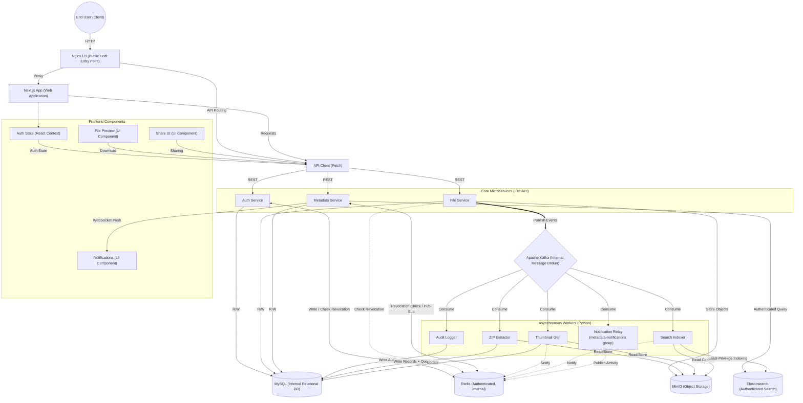
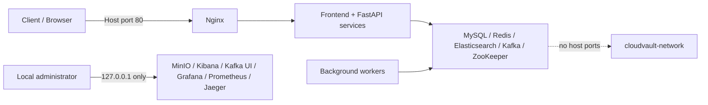

# 🏛️ CloudVault Architecture

This document provides a detailed breakdown of the CloudVault system architecture, as represented in the interactive System Topology dashboard. The system is designed using a multi-layered, event-driven microservices approach.

## 📊 System Diagram

## 📡 Topology Overview

### Layer 1: End User (Client)
- **End User:** The entry point to the system, interacting via web browsers.

### Layer 1.5: API Gateway / Load Balancer
- **Nginx LB:** Acts as the only public host entry point by default, routing incoming HTTP and WebSocket traffic to the appropriate downstream services. TLS should terminate here or at an upstream trusted proxy in production.

### Layer 2: Web Application
- **Next.js App:** The primary frontend web application handling Server-Side Rendering (SSR) and Client-Side Routing.

### Layer 3: Frontend Components & Context
- **File Preview:** UI component for rendering files (images, videos, audio) directly in the browser.
- **Share UI:** UI component for managing file and folder sharing permissions.
- **Auth State (React Context):** Manages user authentication state globally across the frontend.
- **Notifications:** Manages WebSocket connections for real-time toast notifications.

### Layer 4: API Client
- **API Client:** Centralized Fetch-based client (`api.ts`) that adds access tokens, rotates refresh tokens after a `401`, and retries the original request once.

### Layer 5: Core Microservices (FastAPI)
- **Auth Service:** Handles user registration/login, access-token revocation, refresh-token rotation, and refresh-token revocation during logout.
- **File Service:** Streams uploads to MinIO using a bounded 1 MB application buffer, retains versions, calculates physical storage usage, and handles download/delete operations.
- **Metadata Service:** Manages metadata, sharing, search, storage reporting, authenticated WebSocket connections, and the Kafka-to-Redis notification relay.
- **Shared authorization rule:** Auth, File, and Metadata services all reject non-access JWTs, Redis-blacklisted tokens, and inactive users.

### Layer 6: Event Bus & Caching
- **Apache Kafka:** The Docker-internal message broker handling high-throughput, asynchronous events (`file-events`, `user-events`). It has no host port in the default Compose profile.
- **Redis:** An authenticated, Docker-internal service that stores access-token revocation markers checked by every API service and acts as the Pub/Sub broker for WebSocket notifications.

### Layer 7: Asynchronous Workers (Python)
- **Audit Logger:** Sole consumer responsible for persisting supported user/file events to the MySQL audit log.
- **ZIP Extractor:** Extracts uploaded ZIP files with entry-count, expanded-size, compression-ratio, encryption, and user-quota guards before storing results in MinIO/MySQL.
- **Thumbnail Gen:** Consumes Kafka events to generate image thumbnails, stores them in MinIO, and publishes notification events to Redis.
- **Search Indexer:** Consumes Kafka events to parse file content (from MinIO) and index it into Elasticsearch for fast querying.
- **Notification Relay:** Logical worker running inside Metadata Service. It consumes `file-events` with the dedicated `metadata-notifications` consumer group and publishes activity messages to Redis without writing audit records.

### Layer 8: Persistence & Search Databases
- **MySQL:** The primary relational database storing users, metadata, file versions, and audit logs. It is reachable only from `cloudvault-network`.
- **MinIO:** S3-compatible object storage for raw files, thumbnails, and avatars. Its host API and console bind to loopback by default.
- **Elasticsearch:** An authenticated, Docker-internal search engine. Metadata Service and Search Indexer use the dedicated `cloudvault_app` role, scoped to the `cloudvault-files` index; Kibana uses `kibana_system`.

## 🔐 Infrastructure Security Boundary

- Required credentials are injected from the gitignored `.env`; Compose rejects startup when a required secret is absent.
- MySQL, Redis, Elasticsearch, Kafka, and ZooKeeper do not publish host ports.
- Application and administration debug ports bind to `127.0.0.1` by default. Only Nginx binds to `0.0.0.0` unless explicitly reconfigured.
- Elasticsearch rejects anonymous requests and separates the bootstrap administrator, Kibana system account, and least-privilege application account.
- Secret rotation on persistent volumes must update both `.env` and the corresponding datastore account; changing only the environment file does not rotate an existing database user.

---

## 🔄 Data & Event Flows

### 1. Request Flow (Synchronous)
1. The **End User** sends a request to the Nginx host entry point.
2. **Nginx** proxies the request to the **Next.js App** (for UI) or directly to the **API Client**.
3. The **API Client** sends REST requests to one of the Core Microservices (**Auth**, **File**, or **Metadata**).
4. Each protected service validates the JWT signature/type, checks Redis revocation state, and verifies that the user remains active.
5. The services then perform synchronous reads/writes to **MySQL**, **MinIO**, or **Elasticsearch** as required.

### 2. Event-Driven Flow (Asynchronous)
1. When an action occurs (e.g., a file is uploaded), the **File Service** publishes an event to **Kafka**.
2. **Workers** (Thumbnail Gen, Search Indexer, ZIP Extractor, Audit Logger, and Notification Relay) independently consume these events using separate Kafka consumer groups.
3. Workers perform their heavy tasks (e.g., reading from MinIO, indexing to Elasticsearch, writing to MySQL).
4. Notification-producing workers publish to a per-user **Redis Pub/Sub** channel.
5. The **Metadata Service** subscribes to that channel and pushes messages over the authenticated WebSocket connection.
6. The Audit Logger remains the only component that writes Kafka events to `audit_logs`; notification delivery does not compete for its partitions.

### 3. Caching & Auth Flow
1. **Auth Service** verifies credentials against **MySQL**.
2. Access tokens are stateless JWTs with a unique `jti`; refresh tokens are hashed in MySQL and rotated whenever they are used.
3. Logout blacklists the access-token `jti` in **Redis** for its remaining lifetime and revokes the submitted refresh token in **MySQL**.
4. Auth, File, Metadata, and notification WebSocket authentication all enforce the same revocation and active-user checks.

### 4. Upload, Version, and Deletion Flow
1. The File Service reads an upload incrementally in 1 MB chunks to calculate its size and SHA-256 checksum without allocating a second full-file buffer.
2. The stream is rewound and written to **MinIO**, then its metadata/version record and physical-byte usage are committed to **MySQL**.
3. Overwrites retain previous MinIO objects as file versions, so `users.storage_used` includes all unique physical version objects.
4. Soft delete changes metadata only. Permanent delete removes every unique version object plus its thumbnail, deletes relational records, and decrements physical storage usage.

### 5. Guarded ZIP Extraction Flow
1. The ZIP worker spools the source archive with bounded memory.
2. Before extraction it validates entry count, total expanded bytes, suspicious compression ratios, encrypted entries, and the owner's remaining quota.
3. Extracted records and quota changes are committed together; uploaded MinIO objects are cleaned up if extraction fails.

---
*Generated based on the internal `ArchitectureTab.jsx` visual topology.*
