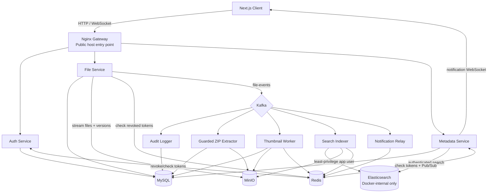

# ☁️ CloudVault — Modern Personal Cloud Storage Platform

[](https://www.python.org/)
[](https://fastapi.tiangolo.com/)
[](https://nextjs.org/)
[](https://www.docker.com/)
[](https://opensource.org/licenses/MIT)

A **production-grade, self-hosted personal cloud storage platform** built with microservices architecture, event-driven design, and modern DevOps practices. Designed to be a scalable, open-source alternative to Google Drive or Dropbox.

> **Current Status**: ✅ Core features, UI/UX, infrastructure secret enforcement, private data-service networking, and authenticated Elasticsearch are enabled in the Docker Compose stack.

---

## ✨ Key Features

### 🌟 Core Capabilities
- **S3-Compatible Object Storage:** Powered by MinIO with bounded-memory streamed uploads and file version retention.
- **Layered Authentication:** JWT access/refresh tokens, refresh rotation, Redis-backed revocation checks in every API service, bcrypt password hashing, and role-based access.
- **Advanced File Sharing:** Generate secure public links with role-based access (View/Edit).
- **File Versioning:** Automatically tracks versions when files are overwritten, allowing seamless restoration via the UI.
- **Event-Driven Architecture:** Apache Kafka streams for asynchronous processing (thumbnail generation, indexing, audit logging).
- **Blazing Fast Search:** Elasticsearch integration with edge n-gram analysis for instant full-text search.

### ✨ Premium UI/UX
- **In-App File Preview:** Instantly preview Images, Videos, and Audio without downloading.
- **Dynamic Views & Layouts:** Toggle between Grid and List views with beautiful, buttery-smooth Framer Motion crossfade animations.
- **Smart Drag & Drop:** Dropzone overlays for intuitive recursive folder uploads.
- **Real-Time Notifications:** WebSockets + Redis Pub/Sub deliver instant toast notifications for background events (e.g., file shared, upload completed).
- **Rich Visuals:** Empty state illustrations, dynamic file type icons, and dark-mode glassmorphism design.

### 🚀 Admin & Analytics
- **Admin Statistics Dashboard:** Real-time system monitoring with interactive Recharts (File Type Distribution, Upload Trends, Top Users).
- **Comprehensive Audit Trail:** Real-time logging of all user and file activities for security and compliance.

---

## 🏗️ Architecture

CloudVault uses synchronous REST/WebSocket paths for user-facing operations and Kafka consumer groups for asynchronous work. Redis is shared by all API services for token-revocation checks and by the notification path for Pub/Sub delivery.



The Audit Logger is the sole owner of audit persistence. The Metadata notification consumer uses a separate Kafka consumer group (`metadata-notifications`) and only relays activity events to Redis, preventing audit and notification workloads from competing for the same messages.

---

## 🛠️ Tech Stack

| Domain | Technology | Purpose |
|--------|-----------|---------|
| **Frontend** | Next.js 14, React, TypeScript | UI, Client-side logic, Framer Motion animations |
| **Backend** | Python, FastAPI, SQLAlchemy | High-performance async microservices |
| **Database** | MySQL 8.0, asyncmy | Relational data persistence (Users, Metadata, Versions) |
| **Cache & Pub/Sub**| Redis 7 | Cross-service JWT revocation checks and WebSocket notification Pub/Sub |
| **Object Storage** | MinIO | S3-compatible file and version storage |
| **Message Broker**| Apache Kafka, Zookeeper | Async event streaming (`file-events`, `user-events`) |
| **Search Engine** | Elasticsearch 8.11, Kibana | Full-text search and management |
| **Monitoring** | Prometheus, Grafana, Jaeger | Metrics, visualization, and distributed tracing |
| **Routing** | Nginx | Reverse proxy, API gateway, WebSocket proxy |

---

## 🚀 Quick Start

### Prerequisites
- Docker & Docker Compose v2+
- Node.js 18+ (for frontend)
- Python 3.11+ (for testing/scripts)

### 1. Start Infrastructure & Backend
```bash
# Clone the repository
git clone https://github.com/hquan07/CloudVault.git
cd CloudVault

# Create local configuration. Generate every blank secret independently with:
# openssl rand -hex 32
cp .env.example .env

# Fill all blank password/secret fields before starting the stack.
# Compose fails closed when a required secret is missing.

# Start all infrastructure, backend, workers, and frontend services
docker compose up -d --build

# Verify all services are running
docker compose ps
```

### 2. Start Frontend
```bash
# The frontend is fully containerized in the docker-compose setup.
# If you wish to run it locally for development instead:
cd frontend
npm install
npm run dev
```
Access the application through Nginx at: **[http://localhost](http://localhost)**. Port `3000` remains available on loopback for local frontend debugging.

---

## 🔌 Service Port Registry

Docker Compose exposes only the gateway publicly by default. Debug and administration UIs bind to loopback; data services have no host port.

| Service / Container | Host Port | Exposure | Description |
|---------------------|-----------|----------|-------------|
| **Nginx Gateway** | `80` | Public (`NGINX_BIND_ADDRESS`) | Main HTTP and WebSocket entry point |
| **Next.js Frontend** | `3000` | Loopback (`APP_BIND_ADDRESS`) | Direct frontend debugging |
| **Auth Service** | `8001` | Loopback (`APP_BIND_ADDRESS`) | User registration and JWT auth |
| **File Service** | `8002` | Loopback (`APP_BIND_ADDRESS`) | File upload, download, and storage |
| **Metadata Service** | `8003` | Loopback (`APP_BIND_ADDRESS`) | Metadata, sharing, search, and WebSocket API |
| **MinIO API / Console** | `9000` / `9001` | Loopback (`INFRA_BIND_ADDRESS`) | S3 API and administration UI |
| **Kibana** | `5601` | Loopback (`INFRA_BIND_ADDRESS`) | Search administration UI |
| **Kafka UI** | `8080` | Loopback (`INFRA_BIND_ADDRESS`) | Kafka cluster administration |
| **Grafana** | `3001` | Loopback (`INFRA_BIND_ADDRESS`) | Metrics dashboards |
| **Prometheus** | `9090` | Loopback (`INFRA_BIND_ADDRESS`) | Time-series metrics |
| **Jaeger** | `16686` | Loopback (`INFRA_BIND_ADDRESS`) | Distributed tracing UI |
| **MySQL / Redis / Elasticsearch / Kafka / ZooKeeper** | None | Docker network only | Internal persistence, search, cache, and messaging |

## 🔐 Infrastructure Security

- Required secrets have no committed defaults. Keep `.env` local and generate a different random value for every password and `JWT_SECRET_KEY`.
- MySQL, Redis, Elasticsearch, Kafka, and ZooKeeper are reachable only inside `cloudvault-network`; application traffic enters through Nginx.
- Elasticsearch security is enabled. Kibana uses `kibana_system`, while Metadata Service and Search Indexer use the dedicated `cloudvault_app` role scoped to `cloudvault-files`.
- Redis requires authentication. Grafana and MinIO no longer accept default credentials.
- Keep `APP_BIND_ADDRESS` and `INFRA_BIND_ADDRESS` set to `127.0.0.1` unless access is protected by a firewall or private network. HTTP TLS should terminate at a trusted reverse proxy in production.

---

## 🧪 Testing

The project includes an end-to-end Python test suite that validates the entire backend pipeline.

```bash
# Install test dependencies
pip install requests

# Run the End-to-End Test Suite
python scripts/test_phase4.py
```

---

## 📝 License

Distributed under the MIT License. See `LICENSE` for more information.
